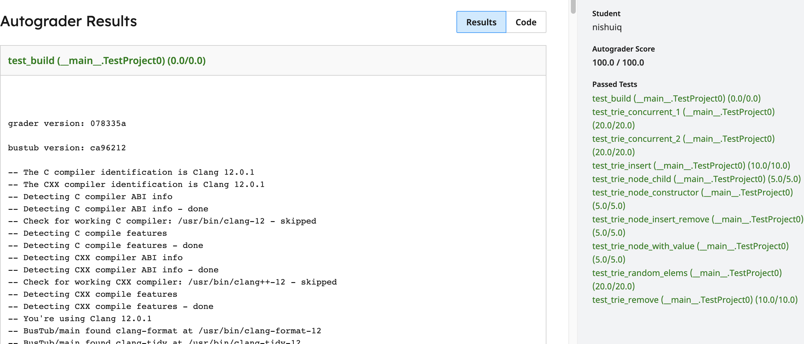
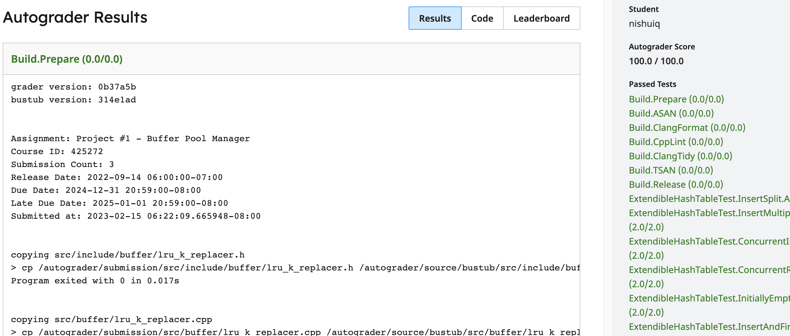
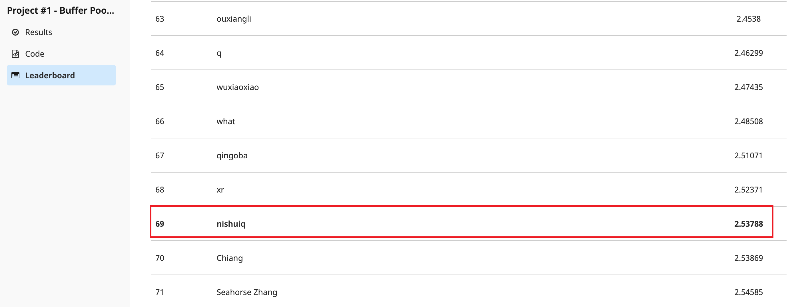

# CMU-15-445

课程作业为 2022 fall

## Projects

- [x] Project 0 - C++ Primer

- [x] Project 1 - Buffer Pool Manager

- [ ] Project 2 - B+Tree Index

- [ ] Project 3 - Query Execution

- [ ] Project 4 - Concurrency Control

## Homework

- [x] SQL

- [ ] Storage & Indexes

- [ ] Query Execution

- [ ] Concurrency Control

- [ ] Distributed Databases

## 截图

